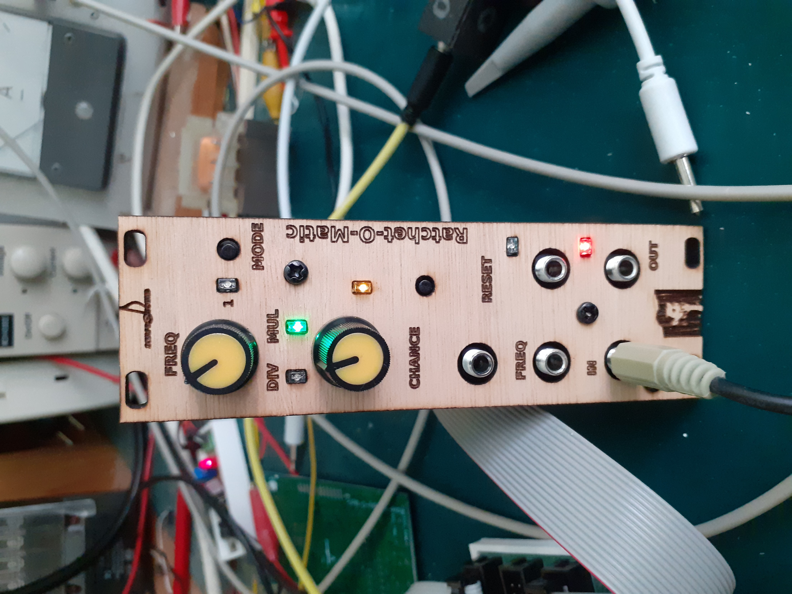

# Ratchet-O-Matic

This is Ratchet-O-Matic, a clock multiplier and clock divider.

While watching a video by Gary P Hayes using a clock multiplier and playing with a Hydra synth at my friend Macross' house I got inspired to make a module that can ratchet, which I will call a ratcheteer.
It has a second mode in which it can divide gate pulses (skip notes).

In this demo ypu can see and hear hand controlled ratcheting and ratcheting using a B960 sequencer to control the ratchet frequency and the odds to ratchet.
Also a short demo of dividing gates is shown.

https://www.youtube.com/watch?v=JYEgaoM7ovk
